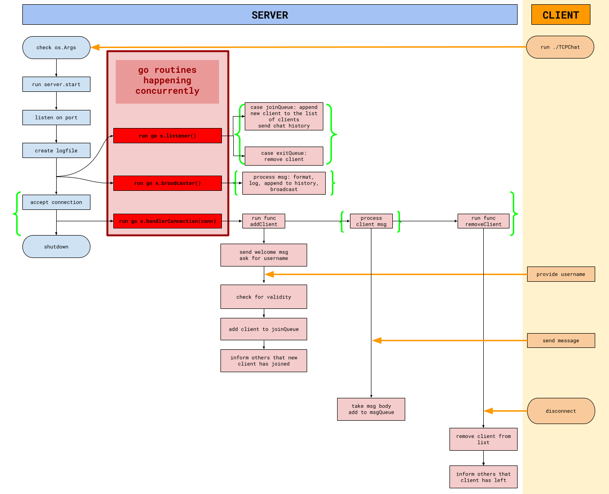

# net-cat

This `net-cat` program recreates the networking utility [GNU Netcat](https://netcat.sourceforge.net/), which reads and writes data across network connections, using the TCP protocol.

Similar to the original Netcat, this version implements the following:
* starts a TCP server that is listening and accepting connections on a specific port
* enables a connection between a server and multiple clients (group chat)
* controls connections upto 10 clients
* requires a non-empty username from the client
* updates new clients with the chat history upon acceptance to the group chat
* informs the other clients of the new client/s who joined and disconnected
* allows clients to leave the group chat without disconnecting other clients
* allows clients to send non-empty messages to each other, identified by the timestamp and username
* implements go routines and channels to manage fucntions running concurrently
* logs all activities into a logfile (bonus)

## Installation

### Prerequisites

Make sure the following are installed in your sytem before running the program:

- [Go](https://golang.org/doc/install) (version 1.20 or later recommended)
- Git, such as [Gitea](https://01.gritlab.ax/git/), to clone the repository

### Steps

1. **Clone the Repository**

	Open your terminal and run:
	
	```bash
	https://01.gritlab.ax/git/isaavuor/net-cat
	cd net-cat
	```

2. **Build the Project**

	Compile the project using the following command:
	
	```bash
	go build -o TCPChat
	```
	
	This will generate the executable file `TCPChat.exe` in the current directory.

## Usage

You can now use the application.

### Run net-cat

The following runs the program with the server listening for connections on the default port `:8989`:

```bash
./TCPChat
```

To specify the port, run the following instead:

```bash
./TCPChat 2525
```

Replace `2525` with the desired port number to listen on.

You are now connected!

### Start Chatting

1. Provide a username.
2. Send messages.
3. Have fun making friends!

## Implementation

Here is a flowchart visually describing this `net-cat` application, showing how the client and server behaves and, most importantly, highlights at what point the go routines are happening:



## Members

* Inka Säävuori 👑
* [Jedi Reston](https://github.com/jeeeeedi) 🤓
* [Yuanneng Lee (Allen)](https://github.com/AllenLeeyn) 🤖
